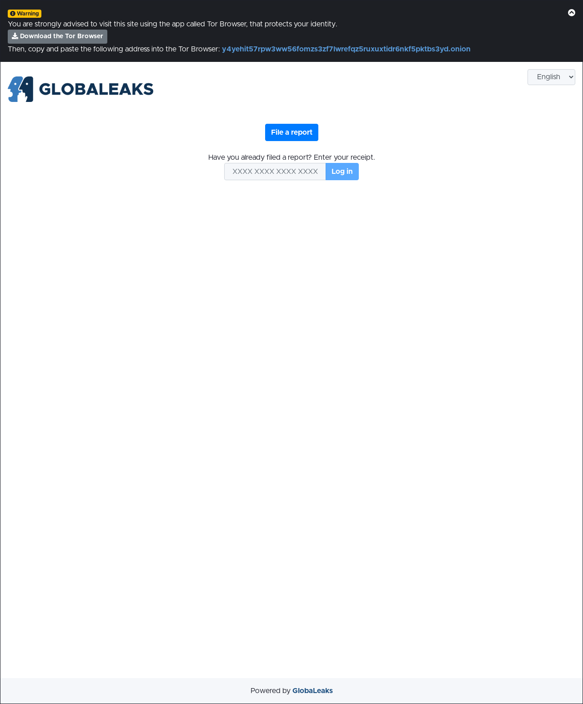
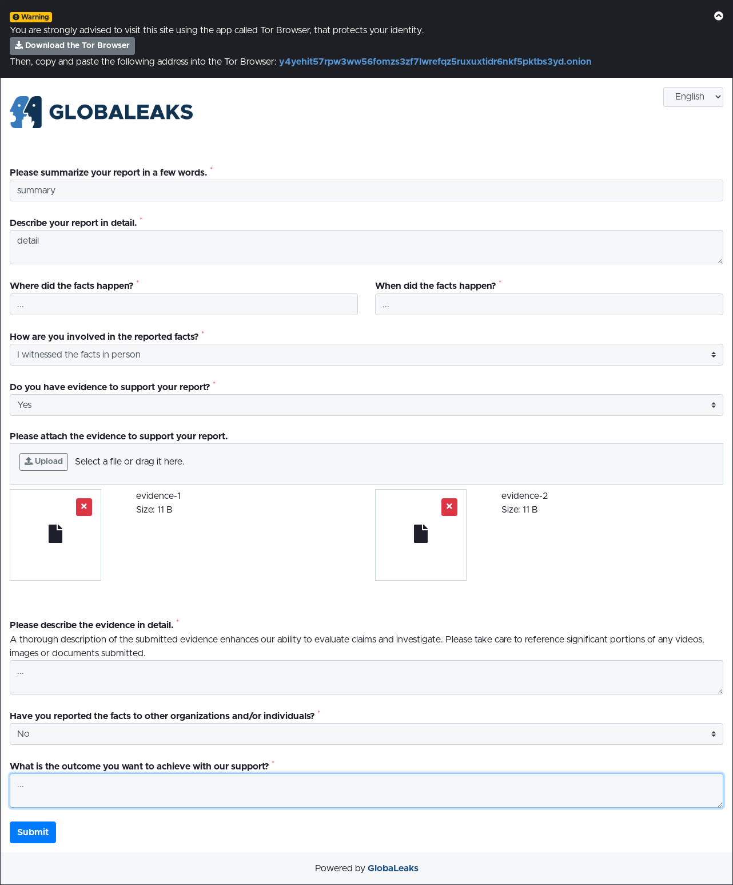
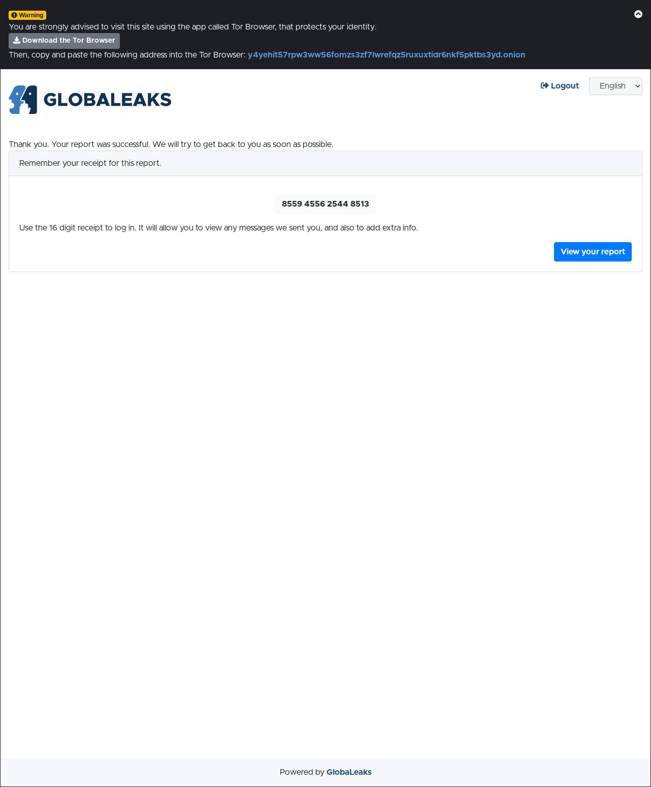

Reporting
=========
Submit a new report
-----------------
You can submit a new report by accessing the homepage of the secure reporting platform and clicking the ``Submit a report`` button.

You will be requested to fill a set of questions. Please note that answering questions marked with the red asterisk symbol is mandatory in order to complete and submit the report.

In the questionnaire you might also be requested to attach evidence: you will be able to upload files as attachments to your report.

Save your access code
---------------------

After your report is submitted, the system will provide you with an access code. You will need to keep this code to log into the platform to view messages from the recipient and/or update your report.

Please be mindful that this is unique, strictly personal, and is generated by the software only once, when you submit your report. You therefore need to copy it (or write it down) the moment you receive it, as it is the only “key” to access the report you have submitted. The organisation does not have access to your code and will not be able to provide it anew in case you lose it.

Access a report
---------------
To access your report, you will need to log in by entering the access code on the homepage of the platform. You will not be able to log in without the code.

.. image:: ../images/whistleblower/receipt_input.png
   :align: center

View report information
~~~~~~~~~~~~~~~~~~~~~~~
Once logged in, you can view your report information on the top of it:

- date and time of initial submission;
- date and time of last update either by you or the recipient;
- date and time of expiration of the report. For security reasons, and to better protect your privacy, reports are kept on the system for a limited period, after which reports and their content are fully deleted. Please don’t omit to read the privacy documentation provided by your organization and to inform yourself about the data retention policy;
- status of the report.

.. image:: ../images/whistleblower/report_info.png
   :align: center

A report can be in the following statuses:

- New: not yet accessed by any recipient;
- Opened: at least one recipient has opened the report and its management is in progress;
- Closed: recipients consider the management of the report as concluded.

Attach a new evidence
~~~~~~~~~~~~~~~~~~~~~
You can update the report by providing new supporting documentation, uploading the files in the “Attachments” section.

.. image:: ../images/whistleblower/report_files.png
   :align: center

Read and send comments
~~~~~~~~~~~~~~~~~~~~~~
You can read comments posted by recipients and send messages to them in the “Comments” section. Comments are allowed even when the report is in status “Closed” and until the date of expiration.

.. image:: ../images/whistleblower/report_comments.png
   :align: center

Provide your identity (optional)
~~~~~~~~~~~~~~~~~~~~~~~~~~~~~~~~
In case you have not done it when submitting the report and if useful for some reasons, you might provide your identity information at a later stage by updating the information in the Identity section.

.. image:: ../images/whistleblower/report_identity.png
   :align: center
