Project roadmap
===============
This document outlines the roadmap for GlobaLeaks, defining its release cycle, update types, and development priorities to ensure a secure, stable, and efficient platform.

Release Cycle
-------------
GlobaLeaks aims to follow a biannual major release cycle, targeting releases in June and December. This structured approach is intended to support the delivery of high-quality updates aligned with user needs.

In addition to major releases, minor updates and security patches are provided as needed. Critical security fixes are addressed immediately and released outside the scheduled cycle to maintain platform security and reliability.

Objectives
----------
The roadmap is designed to minimize unnecessary disruptions while ensuring users receive timely and meaningful updates. This approach provides several key benefits:

- Enhanced Stability: A structured release cycle minimizes disruptions and allows for thorough testing;
- Security and Reliability: Security patches are prioritized and released promptly when necessary;
- Community-Driven Development: Users can engage with the development process through GitHub `Issues <https://github.com/globaleaks/globaleaks-whistleblowing-software/issues>`_ and `Milestones <https://github.com/globaleaks/globaleaks-whistleblowing-software/milestones>`_, contributing to feature prioritization;
- Predictability and Planning: Organizations relying on GlobaLeaks have a clear upgrade path and better preparation for new releases.

Release Types
-------------
1. Minor updates:

- Security patches;
- Small improvements and bug fixes;
- Performance enhancements;
- Addition or revision of translations;
- Minor feature additions that do not introduce breaking changes.

2. Major releases:

- Introduction of new features and significant improvements;
- Possible breaking changes, with clear migration guidelines;
- Detailed release notes and upgrade instructions provided.

Release Workflow
----------------
Project development is organized primarily around two main branches: stable and devel.

These two branches are always aligned at the time a release is issued on the stable branch, which is marked using a Git tag.

Every development is then organized in auxiliary dedicated branches:

- Minor update branches are typically created from the stable branch. These are short-lived branches intended to be merged directly back into stable;
- Major feature branches are always created from the devel branch and are merged back into devel after integration and testing.

Feature Prioritization
----------------------
Development priorities and major release research are published on GitHub using the “Milestones” feature.

Users and contributors are encouraged to:

- Follow the project `Milestones <https://github.com/globaleaks/globaleaks-whistleblowing-software/milestones>`_ to participate in the development process and stay informed about upcoming updates.
- Create `tickets <https://github.com/globaleaks/globaleaks-whistleblowing-software/issues>`_ to submit feature requests and bug reports to help refine development priorities.
- Participate in testing and feedback cycles to ensure releases meet user expectations.

Testing and Quality Assurance
-----------------------------
Each release follows a structured testing process to ensure stability and security:

- Internal Testing: Comprehensive automated and manual testing before public release.
- Community Beta Testing: Pre-release versions available for community testing and feedback.
- Security Audits: Regular security assessments to proactively identify and mitigate risks.

Long-Term Vision
----------------
The roadmap ensures a balanced approach between stability, security, and innovation. The ongoing development of GlobaLeaks is driven by a commitment to providing a reliable and secure platform for whistleblowers and organizations.

For updates and contributions, visit the `GitHub repository <https://github.com/globaleaks>`_.

