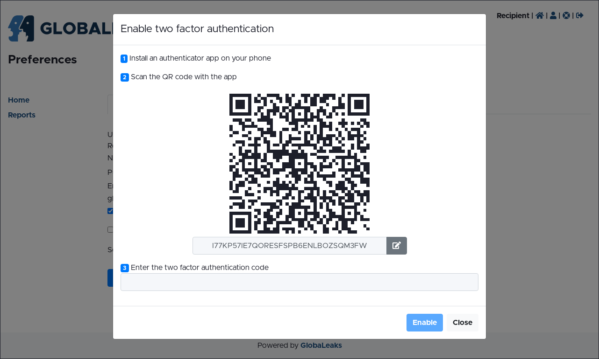

Common to all users
===================
First Login
-----------
Once the new user account is created by an administrator, you will receive an Account Activation email, containing your Username and a link to verify your email and activate your account. By clicking on the activation link the system will invite you to set a personal password.

.. image:: ../images/user/password_change_on_first_login.png
   :align: center

Once the password is set, the system will prompt you to enable Two-Factor Authentication (2FA) (see: Enable Two-Factor Authentication (2FA)). You might not be prompted to enable 2FA at your first login if the administrator has disabled this requirement.

Once you have completed the password and 2FA configuration, you will be logged in and directed to your homepage.

Login
-----
You can login by accessing the /#/login page and filling your username and password.

You will be then asked to insert a 2FA code using your TOTP Authenticator app to complete the authentication process. You might not be prompted to insert a 2FA code if it is disabled on your account.

Configure your preferences
--------------------------
After login you can access your preferences by clicking the icon [:fa:`solid user`] icon in the login status bar. On this page you can:

- change your name;
- change your public name;
- change your email. In this case you will receive an email to the new email address to confirm its association to the user;
- enable/disable email notifications;
- enable/disable Two-Factor-Authentication (see: Enable Two-Factor-Authentication (2FA));
- save your account recovery key (see: Access and save your account recovery key).

Enable Two-Factor-Authentication (2FA)
--------------------------------------
On the default recommended configuration, you will be prompted to enable and set up Two-Factor Authentication (2FA) during your first login, unless this requirement has been disabled by the administrator. To complete the setup, install a standard TOTP Authenticator app on your phone and use it to scan the QR code displayed on the screen. If the administrator has disabled this requirement, you can still enable 2FA manually by selecting "Enable Two-Factor Authentication" in the Preferences page.

Access and save your account recovery key
-----------------------------------------
After first login, you should access your ``Account Recovery Key`` on the ``Preferences`` page and save it in a secure location. You will be prompted to enter your password before the Account Recovery Key is made available.

Please note that this is a fundamental step to ensure possible recovery of your account. Any data received by a user will not be accessible after a password loss and reset without an account recovery key or by the administrator of your platform

Change your password
--------------------
You can change your own password by accessing the ``Password`` tab present in the ``Preferences`` page. Please note that the system prompts users to change their password periodically for security purposes.

.. image:: ../images/user/password_change.png
   :align: center

Reset your password
-------------------
In case you lose your password, you can request a password reset link via the ``/#/login`` page by clicking the ``“Forgot password?”`` button.

After clicking the button you are requested to type your own username or email address. You will receive an email with the reset link.

By clicking on it you will be redirected to the platform and asked to fill in your Account Recovery Key (see: Access and save your Account Recovery Key). You will then be prompted to set up a new password.

Request support
---------------
In case of any technical problem, question or doubt, you can request the support of the administrator of your platform by clicking on the [:fa:`solid life-ring`] icon in the login status bar or in the #/login page of your platform. Use the popup to submit the request.

.. image:: ../images/user/modal_support.png
   :align: center
