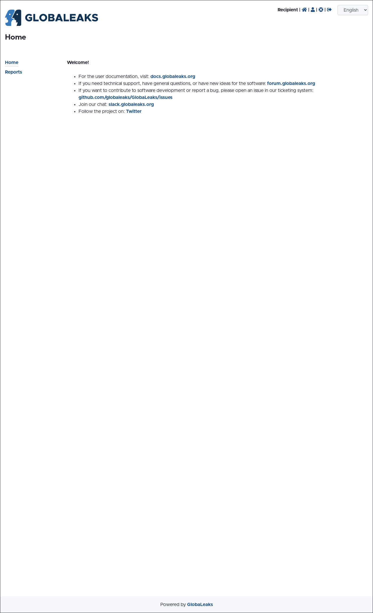
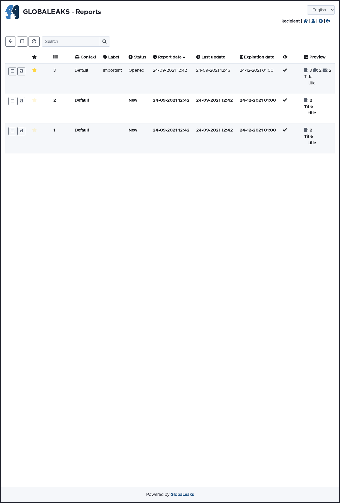
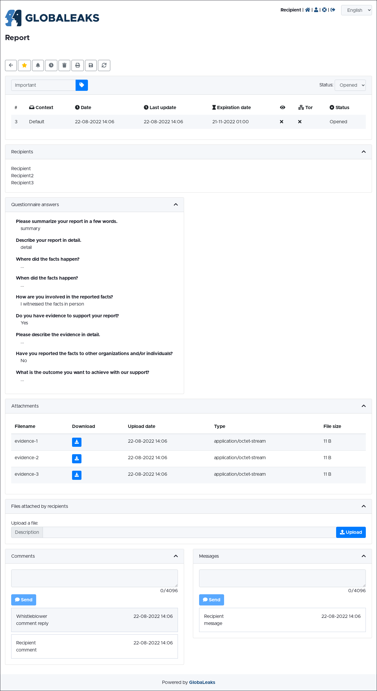

[!] When reading this documentation, please note that optional features are not enabled by default and may be available on the platform only if configured by the administrator.

Access the list of the existing reports
---------------------------------------
You can access the lists of the existing reports via the link “Reports” on the sidebar of your dashboard's homepage. Reports with the most recent activities (new or updated) come first.





From the list you can view for each report:

- whether it is marked as important;
- whether it is set with a reminder;
- whether the reporting person has read the last update;
- the number of comments;
- the number of attachments;
- whether the reporting person has provided their identity through the template identity question (optional, see: Admin > Template identity question);
- the number of recipients.

Order and filter reports
------------------------
You can order the list of reports by channels (if more than one), label (if any), status, report date, last update and expiration date, by clicking on the respective title at the top of the list.

You can filter reports by status.

Select reports
--------------
You can select one or more reports by clicking on the box on the left of the reports' list or you can select all reports by clicking on the [:fa:`square`] icon on the top of the list.

Enter a report
--------------
As recipient, in many circumstances you might need to enter a report received through other channels, for example while assisting by phone or in an in-person meeting. To enter a report received through other channels click on the [:fa:`file-pen`] icon on the top of the list. Then you are offered the same procedure of the reporting person and are asked to fill the existing questionnaire.

At the end of the procedure, the system issues a one-time access code that should be communicated to the reporting person to allow them to access the contents of the report entered by the recipient. The code can be used only once, upon the reporting person’s first access to prevent access by other parties who might intercept it.

Once this initial access has been made, the system generates a new definitive access code that will allow the reporting person to access the report again and continue to monitor its progress. Please note that this feature can be helpful in case the reporting person used a channel other than the platform but is interested in and agrees to rely on the platform later in order to verify the transcription of the report, attach additional evidence, or continue communication with the recipient through this tool.

Refresh the list of reports
---------------------------
You can refresh the list of reports by clicking on the [:fa:`arrows-rotate`] icon on the top of the list.

Search a report
---------------
You can search a report by keywords using the search bar on the top of the list. The system will look for your keywords in the content of reports and filter the list by found results.

Export the list of reports
--------------------------
You can export the list of reports as .CSV file by clicking on the “Export” link at the right bottom of the list.

Access a report
---------------
When a reporting person submits a report, or updates an existing one, you will receive an email notification. You can access the report in two ways:

- by clicking the link provided in the email. Then you will be prompted to log into the system using your credentials (see: Login) and you will be directed to the specific report page;
- by accessing the list of reports via the link ``Reports``` on the sidebar of your dashboard's homepage and clicking on the new or updated report. New or updated reports are in bold.

In any other case, you can access a report by clicking on it from the list of existing reports.



Mark a report as important
--------------------------
After accessing a report, you can mark it as important by clicking on the [:fa:`star`] icon. This feature will allow you to order reports in the list of reports by importance.

Set a reminder
--------------
You can set a reminder for a specific report by clicking on the [:fa:`bell`] icon and setting the desired reminder date. You will receive a notification email on the selected date to alert you that a report has reached the reminder date. You can disable the reminder by following the same procedure.

.. image:: ../../images/recipient/modal_reminder.png
   :align: center

Silence email notifications
---------------------------
You can silence email notifications regarding the update of a specific report by clicking on the [:fa:`volume-off`] icon.

You can turn them on again by clicking on the same icon.

Manage users’ access to report (optional)
-----------------------------------------
You can manage users' access to a specific report by clicking on the [:fa:`users`] icon and selecting one of the options from the dropdown menu:

.. image:: ../../images/recipient/menu_users.png
   :align: center

Grant access to a report
~~~~~~~~~~~~~~~~~~~~~~~~
You can grant a recipient access to a specific report by clicking on the “Grant access” option:

.. image:: ../../images/recipient/menu_users_option_grant_access.png
   :align: center

You will be asked to to select a recipient you want to grant access to.

.. image:: ../../images/recipient/modal_grant_access.png
   :align: center

Their visibility might vary depending on their privileges and the configuration of the platform.

Please note that, in order to complete this procedure, the recipient has to be already added to the list of users of the platform. If not, ask your administrator for assistance.

Revoke access to a report
~~~~~~~~~~~~~~~~~~~~~~~~~
You can revoke a recipient access to a specific report by clicking on the "Revoke access” option:

.. image:: ../../images/recipient/menu_users_option_revoke_access.png
   :align: center

You will be asked to to select a recipient you want to revoke access from.

.. image:: ../../images/recipient/modal_revoke_access.png
   :align: center

Transfer access to another recipient
~~~~~~~~~~~~~~~~~~~~~~~~~~~~~~~~~~~~
You can transfer the access to a specific report to another recipient by clicking on the "Transfer access" option:

.. image:: ../../images/recipient/menu_users_option_transfer_access.png
   :align: center

You will be asked to to select a recipient you want to transfer access to.

.. image:: ../../images/recipient/modal_transfer_access.png
   :align: center

Once transferred you will no longer have access to the specific report.

Perform actions on a report
---------------------------
You can perform specific actions on a report by clicking on the [:fa:`gear`] icon and selecting one of the options from the dropdown menu:

.. image:: ../../images/recipient/menu_actions.png
   :align: center

Edit the expiration date
~~~~~~~~~~~~~~~~~~~~~~~~
The expiration date is set automatically at 23:59 UTC on the day of expiration according to the data retention period set by the administrator on the channel (see: Admin > Data retention policy).

You can edit the expiration of a report to an earlier or later date by clicking on the "Edit the expiration date" option.

.. image:: ../../images/recipient/menu_actions_option_postpone.png
   :align: center

You will be asked to set the desired expiration date:

Please note that you can set an expiration date at least 90 days onward from the day you are editing it and it can be extended up to a maximum of twice the default Data retention policy period. Keep in mind your data retention policy and privacy requirements from your relevant legislation.

.. image:: ../../images/recipient/modal_postpone.png
   :align: center

Mask a report (optional)
~~~~~~~~~~~~~~~~~~~~~~~~
Based on your user priviledges, you can mask or redact selected information in the report by clicking on the “Mask” option.

.. image:: ../../images/recipient/menu_actions_option_mask.png
   :align: center

You will then be able to select the specific information per each question you would like to mask.

.. image:: ../../images/recipient/report_with_masking_enabled_questionnaire_detail.png
   :align: center

.. image:: ../../images/recipient/report_with_masking_enabled_files_detail.png
   :align: center

.. image:: ../../images/recipient/modal_mask_1.png
   :align: center

.. image:: ../../images/recipient/modal_mask_2.png
   :align: center

.. image:: ../../images/recipient/report_after_masking.png
   :align: center

You can discard the operation by clicking the [:fa:`circle-xmark`] icon.

Masked information can be unmasked following the same procedure. Once masked the selected information, you can redact it by selecting the Redact option in the box and then selecting the specific masked information you would like to redact. Please note that redacted information will no longer be available to any recipient and cannot be restored.

Change the status of a report
~~~~~~~~~~~~~~~~~~~~~~~~~~~~~
You can change the status of a report once it has been opened by clicking on the “Change status”  option.

.. image:: ../../images/recipient/menu_actions_option_change_status.png
   :align: center

You will be asked to set the new desired status.

.. image:: ../../images/recipient/modal_change_status.png
   :align: center

Status available by default are:

- New: a report that has not yet been accessed by any recipient (you or another if more than one). This status is set by default and changes automatically to Opened when a report is accessed for the first time. It is the only status that cannot be set by the recipient;
- Opened: for reports that have been accessed for the first time by any recipient and that are considered as in progress. This status is set automatically from New only when a report is accessed for the first time;
- Closed: for reports that are considered as concluded.

Status available can be customized by the administrator according to the report management procedure you have in place.

Delete a report (optional)
~~~~~~~~~~~~~~~~~~~~~~~~~~
Based on your user priviledges, you can delete a report by clicking on the “Delete” option.

.. image:: ../../images/recipient/menu_actions_option_delete_report.png
   :align: center

You will be asked to confirm the operation.

Please note that by deleting a report all the associated data will be permanently deleted and cannot be restored.

Export a report
---------------
You can export reports for offline use or printing by selecting by clicking on the [:fa:`download`] icon and select one of the following options:

.. image:: ../../images/recipient/menu_export.png
   :align: center

Download a report
~~~~~~~~~~~~~~~~~
You can download the report as a .zip file archive including file attachments by selecting the “Download” option.

.. image:: ../../images/recipient/menu_export_option_download.png
   :align: center

Print a report
~~~~~~~~~~~~~~
You can print a specific report by selecting the "Print” option.

.. image:: ../../images/recipient/menu_export_option_print.png
   :align: center

Refresh a report
----------------
In case you would like to see if there is any update to a report while you are logged into the platform, you can refresh the page by clicking on the “[:fa:`rotate`] icon.

Label a report
--------------
You can assign a label to a report by entering it in the “Label” bar. This feature will allow you to order reports in the list of reports by labels or search a specific report by entering the label into the search bar.

.. image:: ../../images/recipient/report_label.png
   :align: center

View report information
-----------------------
You can view the report information on the top of it.

The information available are:

- consequential number of the report;
- date and time of submission by the reporting person;
- date and time of last update either by the recipients or the reporting person;
- date and time of expiration of the report;
- date and time of the reminder (if any);
- whether the reporting person has read the last update;
- whether the reporting person has used the Tor Browser;
- status of the report.

.. image:: ../../images/recipient/report_info.png
   :align: center

Access the reporting person's identity (optional)
-------------------------------------------------
The software offers the possibility to configure a template identity question. If configured by the Administrator of the your platform in your questionnaire, and in case the reporting person has agreed to provide this information, you can access identity information by clicking on the Identity box title and clicking the “Show” button.

In case the Custodian is part of your procedure and the Custodian user has been activated on your platform you have to request access to the reporting person’s identity to the Custodian by clicking on the “Request access to the reporting person's identity” button. Use the pop-up to describe the motivation and send the request. You will receive an email when the Custodian authorizes or denies you the request. In case of authorization you can access the reporting person’s identity in the Identity box of the report.

.. image:: ../../images/recipient/identity_pre_authorization.png
   :align: center

.. image:: ../../images/recipient/identity_post_authorization.png
   :align: center

View and download an attachment
-------------------------------
You can access an attachment sent by the reporting person in two ways:

- by clicking on the [:fa:`eye`] icon and viewing it on the platform. This is the safest procedure because it keeps all the information on the platform;
- by clicking on the [:fa:`download`] icon and downloading it on your device. Please note that this procedure could expose the data and metadata contained in the attachment.

.. image:: ../../images/recipient/report_files.png
   :align: center

Upload a file
~~~~~~~~~~~~~
To upload a file to a report, you should first select who you would like to make it accessible to, by selecting the relevant tab:

- Everyone: the reporting person and all recipients will have access to this file. This is the default tab;
- Recipients only: all recipients to the report (if more than one) will have access to this file. The reporting person will not have access to it;
- Me only: you will be the only person who can access this file. Other recipients (if any) and the reporting person will not have access to it.

You can then upload a file to the report by filling the description in the “Upload a file” bar and by clicking on the “Upload a file” button.

Once uploaded, you can download the file by clicking on the [:fa:`download`] icon or delete it by clicking on the [:fa:`trash`] icon.

.. image:: ../../images/recipient/report_uploads.png
   :align: center

Send a comment
~~~~~~~~~~~~~~
To send a comment, you should first select who you would like to send it to, by selecting the relevant tab:

- Everyone: the reporting person and all recipients can read the comment. This is the default tab;
- Recipients only: all recipients to the report (if more than one) can read the comment. The reporting person will not have visibility of it;
- Me only: you will be the only person who can read the comment. Other recipients (if any) and the reporting person will not have visibility of it.

You can then add your comment in the “Comments” box and click on the “Send” button.

.. image:: ../../images/recipient/report_comments.png
   :align: center
